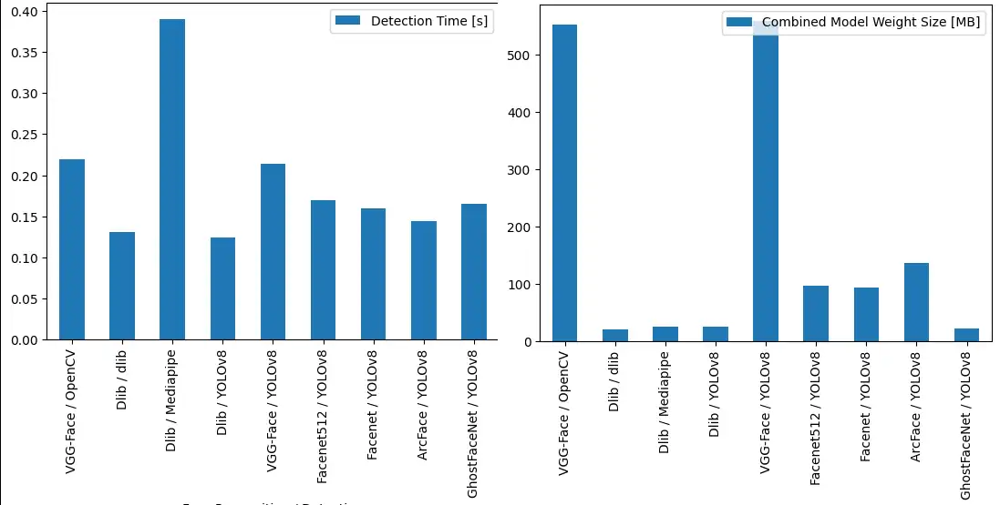
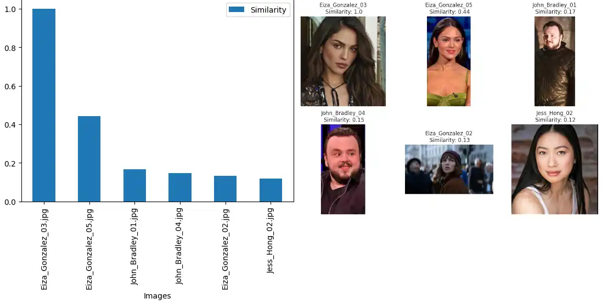
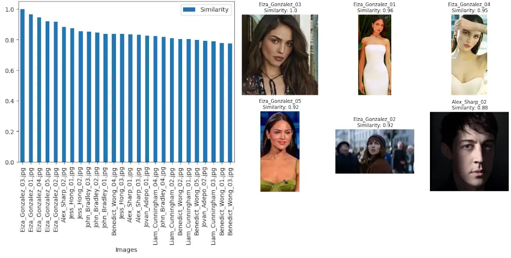
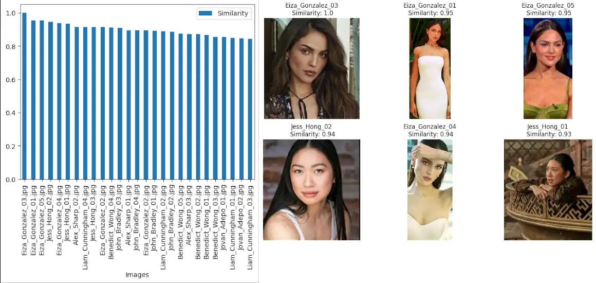
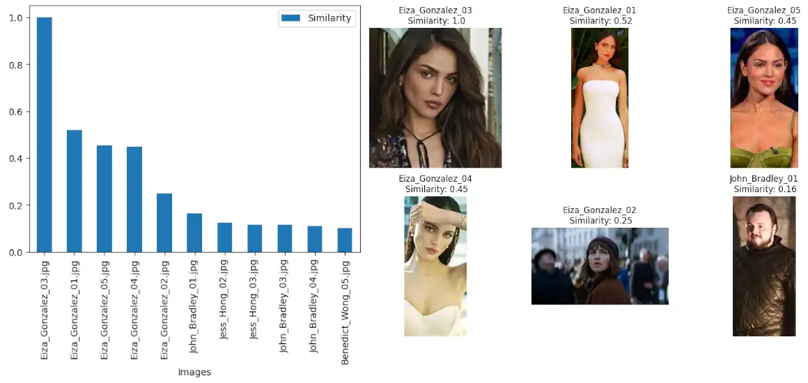
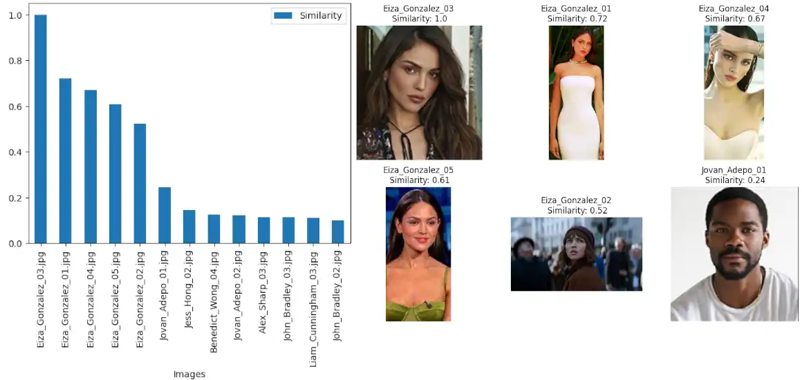
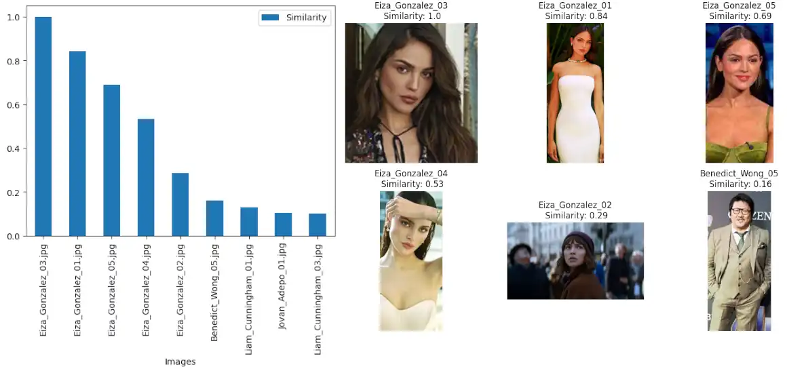
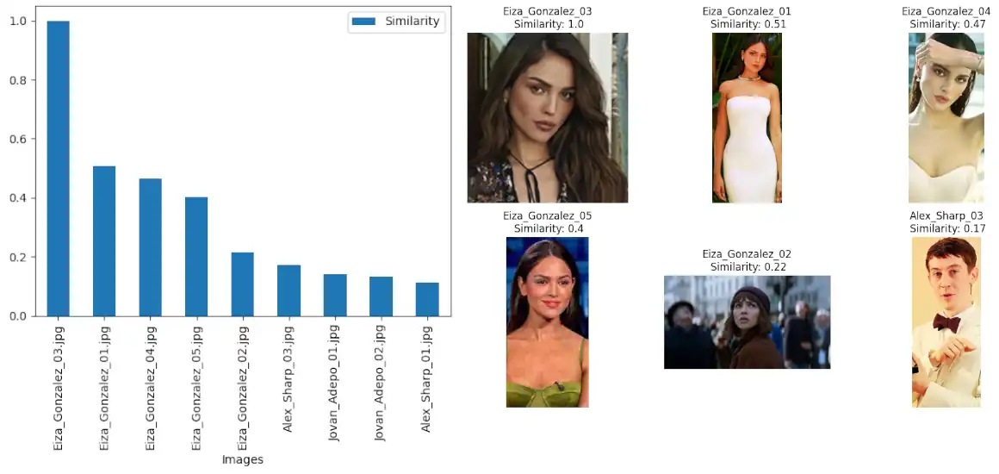
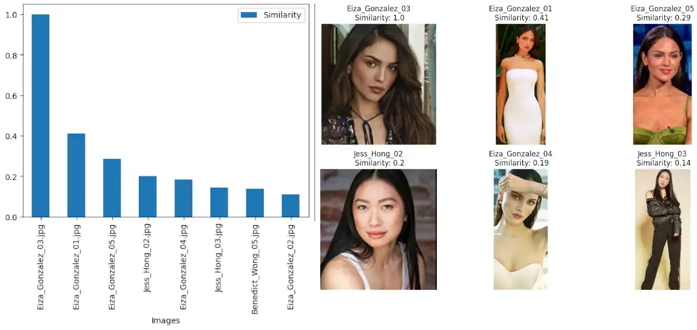

 # Tensorflow DeepFace with Jupyter Notebooks

Start by creating the `deepface` image from the latest `tensorflow/tensorflow` release. Add a `weights` folder to be used to persists downloaded model weights. I did not include the image I used here - you have to place [your own](https://www.google.com/search?q=3+body+problem+cast) in `notebooks/assets`:


```bash
docker build -t tensorflow/deepface .
mkdir weights
mkdir notebooks/assets
```


The command below starts the Docker container with GPU support - to actually use your GPU you need to change the base image to  `tensorflow/tensorflow-gpu` and make sure that the Nvidia Toolkit is installed on your system - e.g. [Enable Docker GPU support on Arch Linux](https://mpolinowski.github.io/docs/IoT-and-Machine-Learning/ML/2022-11-27-containerized-deep-learning/2022-11-27) - all measurements below were taken without GPU support on an older `Intel i7-7700 (8) @ 4.200GHz` CPU:


```bash
docker run --ipc=host --gpus all -ti --rm \
    -v $(pwd)/notebooks:/opt/app/notebooks \
    -v $(pwd)/weights:/root/.deepface/weights \
    -p 8888:8888 --name deepface \
    tensorflow/deepface
```

The __Jupyter Notebook__ will then be available on:


```bash
http://127.0.0.1:8888/tree?token=<Security Token>
```

And give access to the `Deepface.ipynb` notebook. The following is a (selective / __not__ exhaustive) comparison of different face recognition / face detection models that can be used with DeepFace:





I am seeing the best detection and separation with __Facenet512__ and __YOLOv8 Face__:


```python
result = DeepFace.find(
    img_path = "assets/Eiza_Gonzalez_03.jpg",
    db_path = "assets",
    model_name = "Facenet512",
    distance_metric = "cosine",
    enforce_detection = True,
    detector_backend = "yolov8",
    align = True,
    expand_percentage = 0,
    threshold = 0.90,
    normalization = "base",
    silent = False,
)
```


## VGG-Face / OpenCV




## Dlib / dlib




## Dlib / YOLOv8




## VGG-Face / YOLOv8




## Facenet512 / YOLOv8




## Facenet / YOLOv8




## ArcFace / YOLOv8




## GhostFaceNet / YOLOv8

